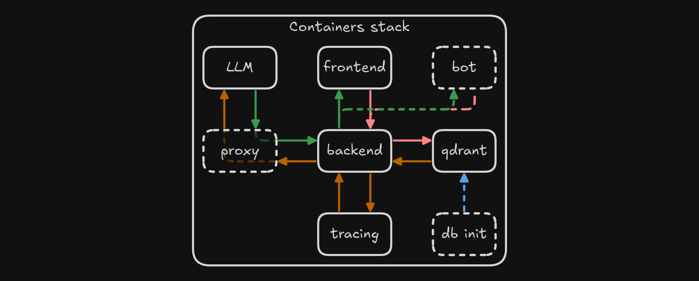
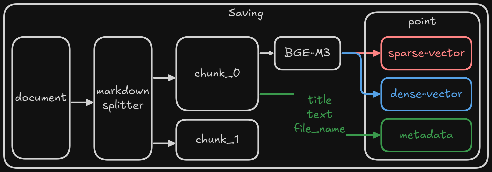
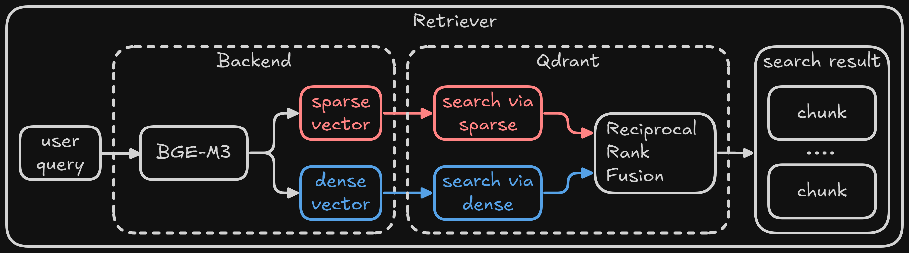

# Obsidian RAG

## Структура проекта
- app
    - api
    - core
- bot
- builds
    - backend
    - frontend
    - init
    - bot
- data
- research

## 🛠 Технологический стек
- **Язык**: Python
- **Фреймворки**: FastAPI, Aiogram, LangChain, FlagEmbedding
- **Векторная БД**: Qdrant
- **Эмбеддинг**: BAAI/bge-m3
- **Фронтенд**: Streamlit
- **Логирование и трейсинг**: MLFlow

## Архитектура

Приложение состоит из следующих компонентов
- фронтенд
- бэкенд
- векторная БД
- сервер для трейсинга
- инициализатор БД (опционально)
- прокси для взаимодействия с LLM (опционально)

Каждый компонент поднимается в Docker контейнере, набор контейнеров оркестрируется с помощью Docker compose.



### Сохранение документов в векторной БД

При сохранении каждый документ:
- Делится на чанки с помощью MarkdownSplitter
- Каждый чанк векторизуется с помощью модели BAAI/bge-m3
- В базу данных сохраняется точка, состоящая из
    - dense вектора
    - sparse вектора
    - метаданных: заголовок, текст, имя файла



### Ретривер

При поиске чанков, релевантных запросу
- Запрос векторизуется с помощью модели BAAI/bge-m3
- Осуществляется "гибридный" поиск по коллекции в Qdrant
    - по dense вектору запроса
    - по sparse вектору запроса
- Результаты поиска по обоим векторам объединяются и реранжируются на уровне БД с помощью RRF (Reciprocal Rank Fusion)
- Top-k наиболее релевантных чанков используются для генерации ответа



## Валидация

### Методика
Для валидации были сгенерированы 10 вопросов по каждому чанку.  
Идеальный ретривер должен возвращать чанк, по которому был сгенерирован вопрос, на первом месте среди релевантных. 

Для оценки полученного ретривера мы использовали такие метрики, как Recall и MRR при k = [1,3,5,10].  
Метрика recall@k может быть интерпретирована как вероятность попадания "целевого" чанка в top-k.  
Метрика MRR (Mean Reciprocal Rank) отражает позицию (в среднем) релевантного чанка в top-k.  

| k | Recall@k | MRR@k |
| --- | --- | --- |
| 1 | 0.66 | 0.66 | 
| 2 | 0.8 | 0.73 | 
| 3 | 0.86 | 0.74999 | 
| 5 | 0.88 | 0.75499 | 
| 10| 0.88 | 0.75499 | 


<details>
<summary>Дисклеймер  </summary>  

Описанная методика оценивания качества ретривера применима далеко не всегда и подразумевает следующие допущения  
- Разрабатываемое RAG приложение в первую очередь ориентировано на ответы на простые вопросы, ответ на которые не "размазан" по нескольким чанкам  
- Информация, необходимая для ответа на вопрос, есть только в "целевом" чанке, по которому были сгенерированы вопросы, чанки не скучены в кластера и достаточно отличны друг от друга  

</details>

Для валидации конечных ответов были отобраны 100 наиболее правдоподобных вопросов.  
Для каждого вопроса был сгенерирован и провалидирован ответ.
В дальнейшем при внесении изменений в chain можно генерировать ответы на эти вопросы и сравнивать с провалидированными, например, с помощью BLEU/ROUGE-L.

Для конечных ответов были получены следующие метрики (при сравнении с эталоном):

| BLEU | ROUGE-L | 
| --- | --- |
| 0.544024 | 0.758633 | 

Также была рассчитана токсичность ответов:
| Toxicity | 
| --- |
| 0.01179 | 

## Начало работы

### Деплой

1.  Клонируйте репозиторий
    ```bash
    git clone https://github.com/sixxio/obsidian-rag.git
    cd obsidian-rag
    ```
2.  Создайте файлы .env и config.json и заполните их на основе предоставленных примеров ([app/.env.example](app/.env.example), [config_example.json](config_example.json)).

3.  Соберите и запустите Docker-контейнеры
    ```bash
    docker compose up -d
    ```

4.  Посетите приложение по адресу http://localhost:80.
